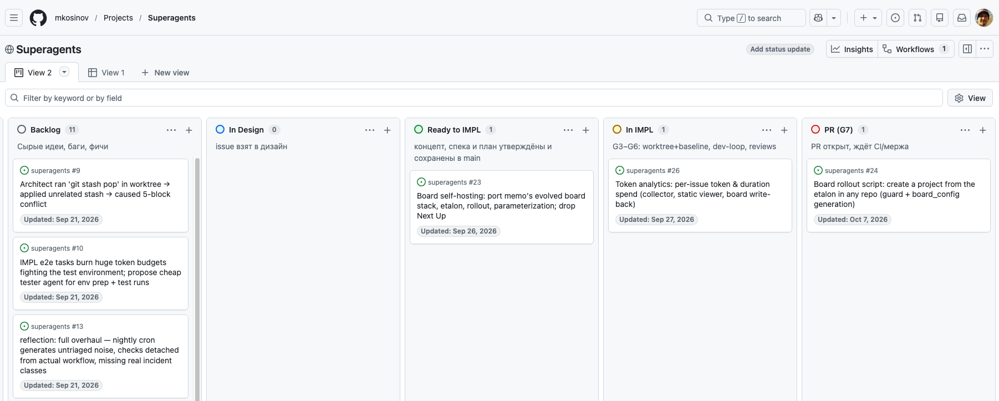
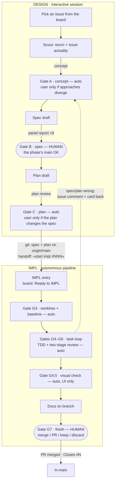

# SuperAgents

> A reusable agentic workflow framework for AI-driven software development.
>
> **Version:** 3.15
>
> **New project?** [New Project Setup](docs/setup/new-project-setup.md)

## What is SuperAgents?

SuperAgents is a **pipeline for AI-driven software development**, built on the **spec-driven** and **TDD** approaches. The unit of work is a **GitHub issue**.

Every issue goes through **two independent phases**, coupled only by the seam below. Each phase may run in its own environment — the recommended setup separates them: an interactive session for DESIGN, an autonomous **Docker container** for IMPL. **DESIGN** is an interactive session: a human approves the reviewed spec (the phase's single mandatory gate). **IMPL** is an autonomous pipeline: the human decides only at the finish. The only thing that crosses between them is **git** — the pushed spec and plan (on the way back, the issue's comments record why a spec or plan was rejected). Work on the project is visualized on the **GitHub Project board**: each card's status mirrors the last gate its trajectory passed, and a card waiting for the user shows the pending ask; the board carries no context.



The workflow is defined once as **theory** and implemented per harness as an **adapter**:

- **Theory** — `docs/workflow/` + `docs/architecture/`: phases, gates, roles, artifact formats, the git seam. Harness-neutral; names roles (session manager, controller, implementers, reviewers), never tools.
- **Adapters** — `.zcode/` (zcode) and `.opencode/` (opencode): the mechanics — dispatch tools, agent/skill formats, scripts, paths, model assignments. They reference the canon and never re-tell it.
- **Boundary criterion:** a rule is theory if you can verify it from artifacts alone (spec, plan, PR, board); if verifying it requires a specific tool or path, it belongs to an adapter.

## The pipeline



**Stadium / amber = human gate** — the user decides. **Rectangle / green = auto gate** — passes itself, stops the user only on a defined condition. Board statuses along the way: `In Design` (all of DESIGN) → `Ready to IMPL` → `In IMPL` → `PR (G7)` → `In-main`.

Small post-merge polish skips the pipeline — the fast-track protocol (FasTP), see [impl-phase.md](docs/workflow/impl-phase.md).

## Where the details live

- [DESIGN phase reference](docs/workflow/design-phase.md) — gates A/B/C, scout, spec panel, plan review, the seam contract, fast-track
- [IMPL phase reference](docs/workflow/impl-phase.md) — plan-only entry, G3–G7, role architecture, review tiers, FasTP
- Architecture notes: [token economy](docs/architecture/token-economy.md) · [context management](docs/architecture/context-management.md) · [decision log](docs/architecture/decision-log.md)
- [Setting up a new project](docs/setup/new-project-setup.md)
- [Maintaining the framework](docs/maintaining-the-framework.md) — golden source rule, change/sync protocol, language convention

## Repository layout

```
superagents/
├── docs/         # theory: workflow/, architecture/, setup/ (+ dated specs/plans as history)
├── .zcode/       # zcode adapter — DESIGN on the host
├── .opencode/    # opencode adapter — IMPL in the container
└── site/
```

## Changelog

See [docs/changelog.md](docs/changelog.md).

## License

MIT / Proprietary — for internal use in AI-assisted development workflows.
